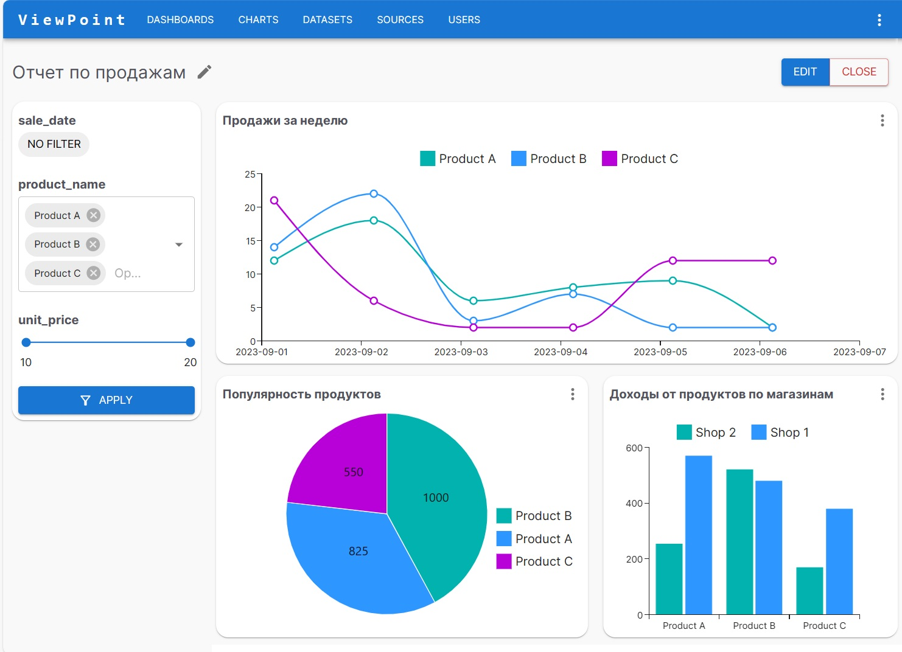
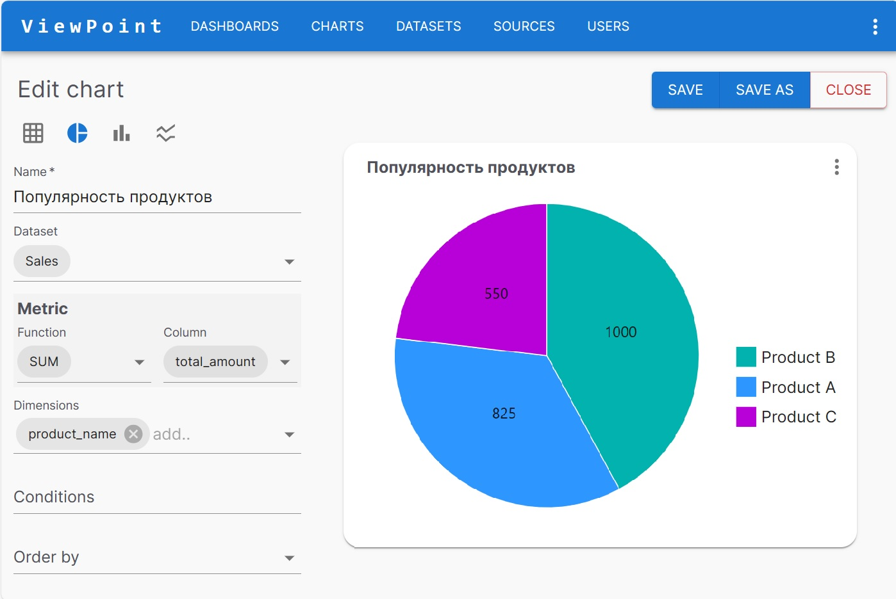
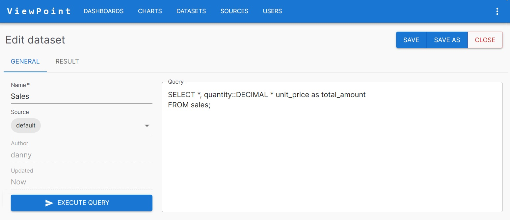
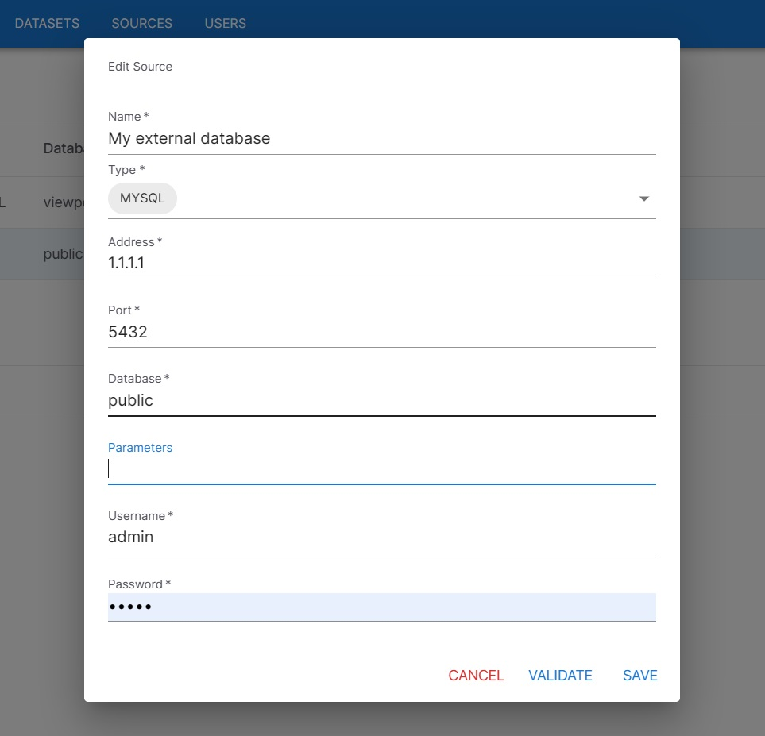
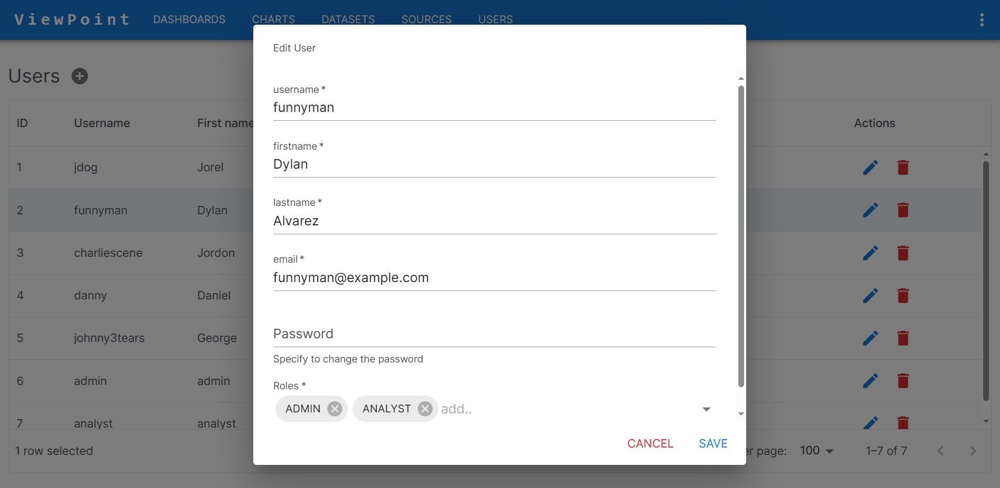
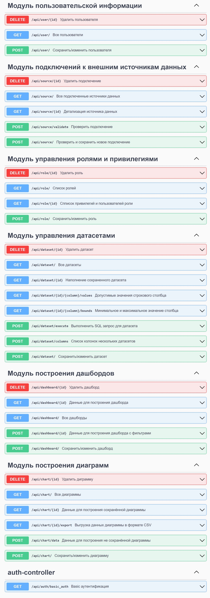

# Viewpoint - BI System
## Описание
Проект представляет собой Business Intelligence систему, предназначенную для визуализации данных из различных источников.

### Возможности
* Подключение нескольких источников данных (баз данных)
* Редактор SQL для запросов к источникам
* Визуализация данных при помощи таблиц и диаграмм (столбчатые, круговые, линейные)
* Построение дашбордов и применение фильтрации
* Авторизация и хранение каталога пользователей
* Разделение доступов к каталогам по ролям и привилегиям
* Экспорт данных из диаграмм в формате csv

-----------

<b>СКРИНШОТЫ</b>

*Дашборд*

*Редактор диаграмм*

*Редактор наборов данных*

*Источники данных*

*Редактор пользователя*

-----------

### Технологии
* **Framework**: Spring Boot 3 *(Security 6, Data JPA, Validation)*
* **Build**: Maven
* **ORM**: Hibernate
* **DB**: postgres
* **Containers**: Docker, Docker-compose
* **Mapping**: Mapstuct
* **Swagger**: springdoc openapi
* **Front**: React.js, Material UI
* **Other**: Lombok

### Структура проекта
* viewpoint-backend - **Серверное приложение (Spring boot 3)**
* viewpoint-frontend - **Клиентское приложение (React.js)**
* docker - Дополнительные настройки контейнеров Docker

### Пакеты серверного приложения (package-by-feature):
**Chart** - Наполнение диаграмм, стратегии трансформации данных  
**Dashboard** - Построение диаграмм и применение фильтров на дашбордах  
**Datasets** - Выполнение SQL-запросов на источниках данных  
**Security** - Конфигурация Spring Security (авторизация, роли, привилегии)  
**Sources** - Валидация и подключение к сторонним источникам данных  
**Users** - Логика работы с информацией о пользователях 
**Utils** - Вспомогательные классы (SqlBuilder, CsvFormatter...)  

-----------

<b>SWAGGER</b>

-----------

## Инструкция для запуска
    git clone https://github.com/grebennikov-undrew/viewpoint.git
    cd viewpoint
    docker-compose up

http://localhost:3000/ - клиент, для входа использовать admin/admin  
http://localhost:8081/ - серверная часть  
http://localhost:8081/swagger-ui/index.html#/ - доккументация API